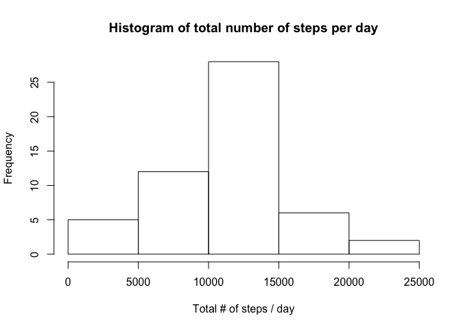
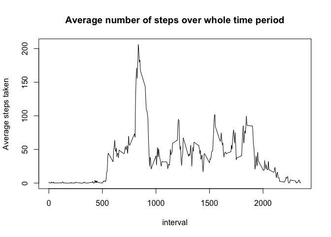
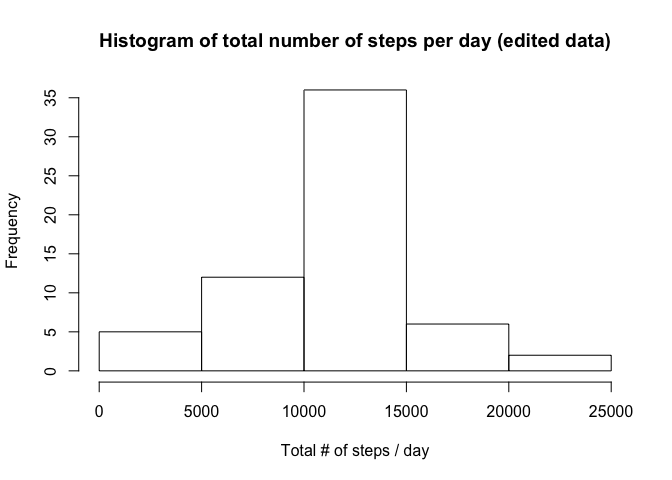
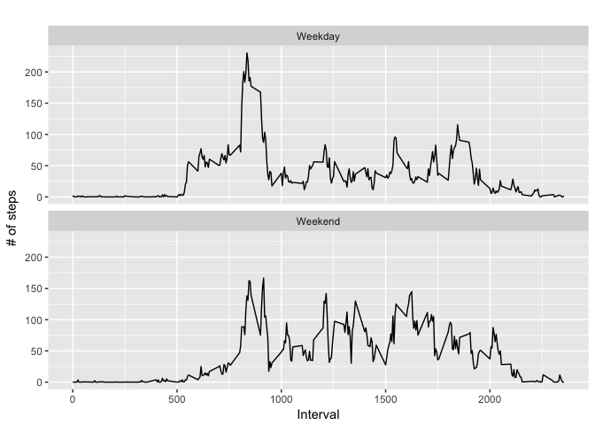

# Reproducible Research: Peer Assessment 1


## Loading and preprocessing the data


```r
setwd("/Users/costal3/projects/R/data_analysis")
raw_data<-read.csv("activity.csv")
head(raw_data)
```

```
  steps       date interval
1    NA 2012-10-01        0
2    NA 2012-10-01        5
3    NA 2012-10-01       10
4    NA 2012-10-01       15
5    NA 2012-10-01       20
6    NA 2012-10-01       25
```
Remove all NA's, add calculated day, calculate summarised steps/day


```r
activity<-na.omit(raw_data)
activity$data <- as.Date(activity$date)
steps_per_day <- summarise(group_by(activity, date), total = sum(steps))

hist(steps_per_day$total,
   main="Histogram of total number of steps per day",
   xlab="Total # of steps / day")
```

<!-- -->

```r
mean_steps<-mean(steps_per_day$total)
median_steps <- median(steps_per_day$total)
```


## What is mean total number of steps taken per day?

- Mean total number steps per day is 1.0766189\times 10^{4}  
- Median total number of steps per day is 10765  
- Data recorded between 2012-10-02 and 2012-11-29  

## What is the average daily activity pattern?


```r
average_steps_per_day <- aggregate(steps~interval, activity, FUN="mean")
plot(average_steps_per_day,
   type="l",
   main="Average number of steps over whole time period",
   ylab="Average steps taken")
```

<!-- -->

```r
max_step_interval <- average_steps_per_day$interval[which.max(average_steps_per_day$steps)]
```

- The highest average step count happened during interval 835

## Imputing missing values
- Calculate the number of missing observations
- Fill in missing data with medians

```r
total_missing_values <- sum(is.na(raw_data$steps))
```
- There are 2304 missing observations (NAs) in the data
- For those NA's, let's calculate the observed average steps from similar intervals

```r
edited_data <- raw_data
for (i in 1:nrow(edited_data)) {
   if (is.na(edited_data$steps[i])) {
      #Find average steps for this interval (i) and provision on edited_data$steps
      j <- which (edited_data$interval[i] == average_steps_per_day$interval)
      edited_data$steps[i] <- average_steps_per_day[j, ]$steps
   }
}
```
- Make a histogram of the total number of steps taken each day and Calculate and report the mean and median total number of steps taken per day

```r
steps_per_day <- summarise(group_by(edited_data, date), total = sum(steps))

hist(steps_per_day$total,
     main="Histogram of total number of steps per day (edited data)",
     xlab="Total # of steps / day")
```

<!-- -->

```r
mean_steps <- mean(steps_per_day$total)
median_steps <- median(steps_per_day$total)
```
- Mean total number steps per day is 1.0766189\times 10^{4} (same as before)  
- Median total number of steps per day is 1.0766189\times 10^{4} (slighlty higher)  

## Are there differences in activity patterns between weekdays and weekends?

```r
#Mark weekday/weekend using function weekdays and provision on day_type
edited_data$day <- weekdays(as.Date(edited_data$date))
edited_data$day_type[edited_data$day %in% c("Saturday", "Sunday")] <- "Weekend"
edited_data$day_type[is.na(edited_data$day_type)] <- "Weekday"

#calculate new average steps per day
plot_data<-aggregate(edited_data$steps, by=edited_data[c("day_type", "interval")], FUN="mean")
names(plot_data)<-c("day_type", "interval", "Average_steps")

#Plot it
qplot(interval, 
   Average_steps, 
   data = plot_data, 
   geom=c("line"),
   xlab = "Interval", 
   ylab = "# of steps", 
   main = "") +
   facet_wrap(~ day_type, ncol = 1)
```

<!-- -->

